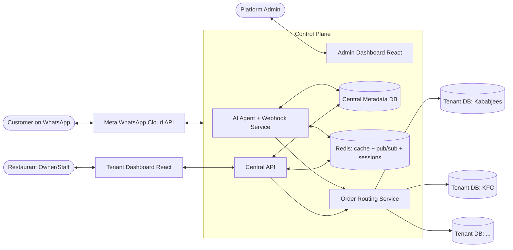
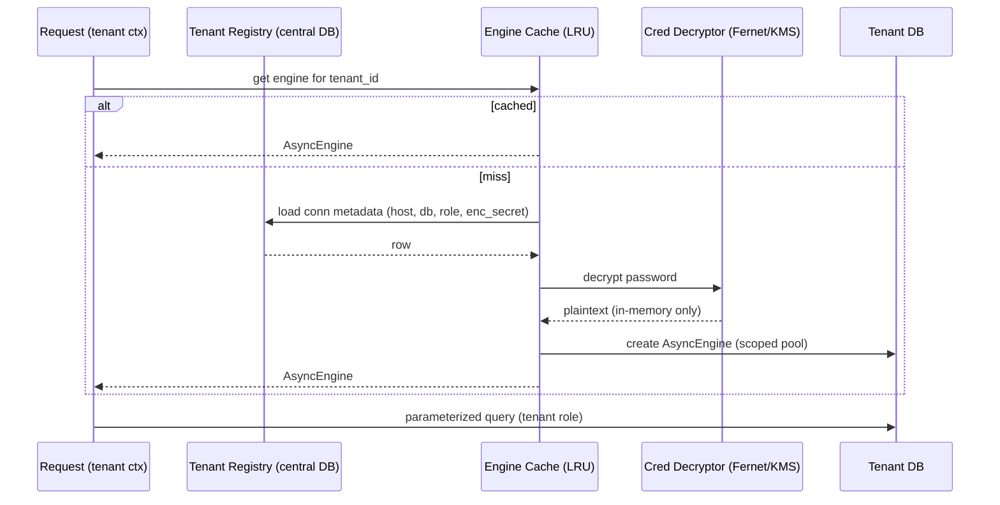
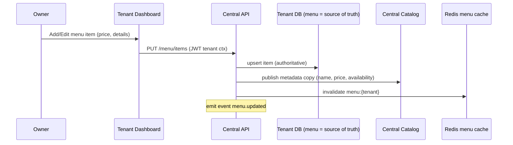
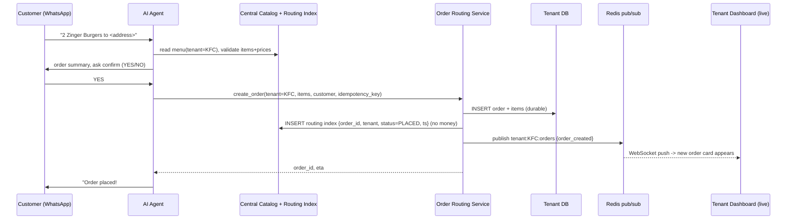
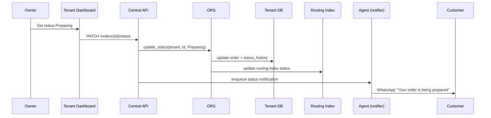

# Phase 01 — Architecture & Multi-Tenancy Strategy

## 1.1 Guiding principles

1. **Isolation first.** A cross-tenant data leak is the worst possible failure.
   Enforce isolation in depth: routing → DB role → application authz.
2. **Central knows metadata, not money.** The control plane stores only what the
   agent needs to sell (menu, prices, names) and to route (order id/status). It
   never stores tenant balances, revenue totals, or customer-private records.
3. **Tenant owns its data.** Order details, customer info for that order, and
   financial analytics live exclusively in the tenant's own database.
4. **One codebase, many tenants.** Avoid N deployments. A tenant-aware application
   resolves the tenant per request and connects to the right database.
5. **Async + event-driven** for real-time and for decoupling the agent from the UI.

## 1.2 Multi-tenancy model decision

Three classic options were evaluated:

| Model | Isolation | Cost/Ops | Fit for brief |
|------|-----------|----------|---------------|
| Shared schema + `tenant_id` + RLS | Logical only | Cheapest | ❌ Brief demands separate DBs |
| Schema-per-tenant (one DB, many schemas) | Medium | Cheap | ⚠️ Partial |
| **Database-per-tenant** | **Strong (physical)** | Higher | ✅ Matches "separate DB, no cross access" |

**Decision: Database-per-tenant.** Each restaurant gets its own PostgreSQL
database **and its own dedicated DB role** with privileges scoped to *only* that
database. Even if application code had a bug, the tenant's DB credentials cannot
read another tenant's database at the Postgres level.

> Railway note (cost-aware): On Railway each Postgres *service* is a container.
> Running one Postgres *service* per tenant is the strictest but costliest. The
> recommended pragmatic default is **multiple databases + roles inside one Postgres
> cluster/service**, which still gives separate databases and separate credentials
> (true cross-DB access in Postgres requires explicit setup like `dblink`/FDW,
> which we never configure). You can promote high-value tenants to dedicated
> Postgres services later without code changes, because connections are resolved
> from a registry. See Phase 09 for the cost/scaling ladder.

### Why not RLS-only?
RLS (row-level security) is excellent but is *logical* isolation in a shared
database — one misconfigured policy or a `SET ROLE` slip can leak data, and it
does not satisfy the explicit requirement that "none of each other could access
other tenant db." We still *use* RLS-style defense ideas, but physical DB
separation is the backbone.

## 1.3 System context (C4 level 1)

## 1.4 Components (C4 level 2)

### Control plane
- **AI Agent + Webhook Service** (evolves current `app/`): receives WhatsApp
  webhooks, verifies signatures, runs the Gemini agent with tool-calling, reads the
  **central catalog** for menus, and calls the **Order Routing Service** to create
  orders. Holds conversation state in Redis.
- **Central API** (FastAPI): authentication, tenant onboarding/provisioning,
  central admin endpoints, menu publish ingestion, order-routing-index queries,
  WebSocket gateway for tenant dashboards.
- **Order Routing Service** (a module/library, not LLM-exposed): owns the per-tenant
  engine/connection cache, decrypts tenant DB credentials, performs writes/reads in
  the correct tenant DB, and emits real-time events. **This is the only component
  that connects to tenant DBs.**
- **Central Metadata DB** (Postgres): tenants registry, users/roles, central catalog
  (menus/prices), order routing index, audit log, WhatsApp number mapping. (Schema in P02.)
- **Redis:** conversation sessions, menu cache, rate limiting, and pub/sub fan-out
  for real-time order events to WebSocket clients.
- **Admin Dashboard (React):** platform admin UI.

### Data plane
- **Tenant DB (per restaurant):** orders, order items, customers (for that tenant),
  menu source-of-truth, status history, financial analytics source data. (Schema in P02.)
- **Tenant Dashboard (React):** the *same* React app as below, scoped by subdomain/JWT.

> The Tenant Dashboard and Admin Dashboard can be one React monorepo with two
> entry apps sharing a design system (Phase 06), or one app with role-based routing.
> Recommended: **one app, two layouts** (`/admin/*` vs tenant scope) for DRY design.

## 1.5 Tenant resolution & connection routing

Every request that touches tenant data must resolve a `tenant_id` and obtain a
connection to *that* tenant's DB. Sources of tenant identity, in priority order:

1. **JWT claim** `tenant_id` (for dashboard API calls) — validated against the
   request host/subdomain to prevent token replay across tenants.
2. **Subdomain** `kababjees.app.com` → `tenant_slug` (dashboard hosting).
3. **WhatsApp number mapping** (for the agent) — the inbound `phone_number_id`
   (the business number the customer messaged) maps to a tenant; OR, if a single
   central number is used, the agent asks the customer to choose a restaurant and
   resolves it from the central catalog.

Connection routing flow:

Key rules:
- Engines are cached **per tenant** (LRU with idle eviction) to bound connections.
- Each engine uses the **tenant-specific DB role** — least privilege, only its DB.
- Decrypted credentials live only in memory; encrypted at rest in the registry.
- A request can hold **at most one** tenant engine; mixing tenants in one unit of
  work is forbidden by design (the context object is single-tenant).

## 1.6 Core data flows

### A) Menu publish (tenant → central catalog) — keeps the agent fresh

The tenant DB is the **source of truth** for menu; the central catalog is a
read-optimized projection the agent uses. Eventual consistency target < 10s
(usually instant). If the projection write fails, a reconciliation job retries.

### B) Order placement (agent → tenant DB) — the core flow

**Durability rule:** the order is written to the tenant DB *before* the customer
gets a confirmation, so a confirmed order is never lost. Idempotency keys prevent
duplicates on retries.

**Consistency rule (see P12 F3):** the central routing-index write is **not** a
second synchronous write. Instead a `routing_outbox` row is written *inside the same
tenant transaction* as the order; the worker projects it to
`central.order_routing_index`. This avoids dual-write inconsistency if the process
crashes between writes. The tenant DB is the source of truth; central is eventually
consistent (seconds) and self-heals via a reconciler.

### C) Order status update (owner → customer)

## 1.7 Why this satisfies the constraints

- **"Central has metadata, not balance":** Central stores catalog + routing index
  (status/timestamps), never amounts/balances. Money lives only in tenant DBs (P02).
- **"Separate DB, no cross access":** Database-per-tenant + per-tenant roles. The
  routing service is the single chokepoint and is single-tenant per unit of work.
- **"Real-time tenant dashboard":** Redis pub/sub → WebSocket push on every order
  event (P05).
- **"Menu edit reflects centrally":** Menu publish projection + cache invalidation (P05).
- **"Same design, different data":** Shared React design system, tenant-scoped data (P06).

## 1.8 Technology choices (summary)

| Concern | Choice | Rationale |
|--------|--------|-----------|
| Backend | FastAPI (async) + SQLAlchemy 2.0 async + asyncpg | Brief; great async + typing |
| Migrations | Alembic (per-DB, applied to central + each tenant) | Repeatable provisioning |
| AI | Google Gemini (existing) via function-calling | Already integrated; low cost |
| Realtime | FastAPI WebSocket + Redis pub/sub | Scales across instances |
| Cache/sessions/rate-limit | Redis | One dependency, many uses |
| Frontend | React + Vite + TS + Tailwind + shadcn/ui + Recharts + TanStack Query | Modern, fast, charts (P06) |
| Secrets | Railway env + Fernet/KMS for tenant creds | Encrypted at rest |
| Deploy | Railway services + Postgres + Redis | Brief |

Proceed to [Phase 02 — Database Design](./02-database-design.md).
