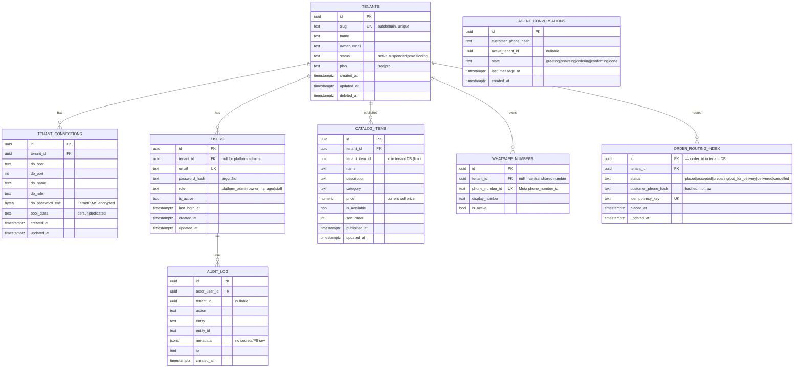
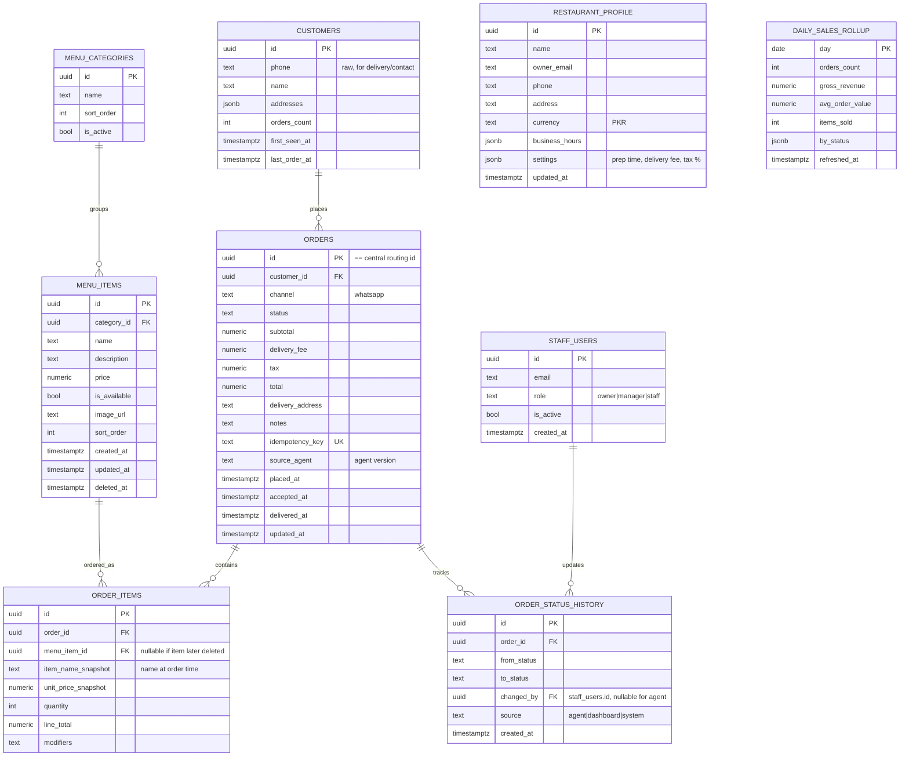
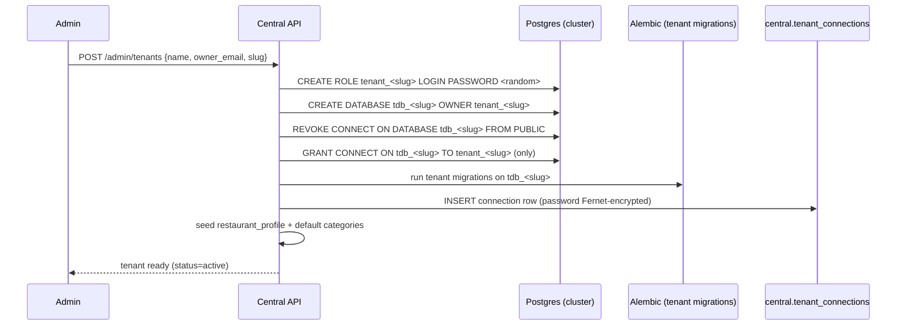

# Phase 02 — Database Design

Two distinct schemas:

- **Central Metadata DB** — one database for the whole platform (control plane).
- **Tenant DB schema** — *identical* schema instantiated once per restaurant
  (data plane). Same DDL, different data, separate databases & roles.

Conventions: `snake_case`, UUID v7 primary keys (time-sortable; fall back to
`gen_random_uuid()` if v7 unavailable), `timestamptz` everywhere (store UTC),
money as `NUMERIC(12,2)` (never floats), soft-delete via `deleted_at` where useful,
`created_at`/`updated_at` audit columns on every table.

---

## 2.1 Central Metadata DB

> Holds only what the platform needs to *route* and *sell*. **No order amounts,
> no balances, no revenue.** The routing index intentionally omits money.

### Notes & rationale (central)
- **`tenant_connections.db_password_enc`** is encrypted with a Fernet key (or KMS)
  held only in the control-plane env. Compromising the central DB dump alone does
  not yield tenant DB access (key is separate). See P08.
- **`order_routing_index`** stores **status + timestamps + hashed phone + idempotency
  key only**. No `total`, no `amount`. This is what lets central "track orders" while
  honoring "central does not have balance/money."
- **`catalog_items`** is the agent's menu source. `price` lives here because the agent
  must quote prices — prices are *menu metadata*, which the brief explicitly allows
  ("menu, price"). It is **not** revenue/balance.
- **`customer_phone_hash`**: store HMAC-SHA256(phone, pepper), never raw phone in
  central, to minimize PII centrally (the raw phone for delivery lives in tenant DB).
- **`users.tenant_id` null** → platform admin. RBAC enforced in app + checked in P08.
- **Indexes:** `tenants(slug)`, `users(email)`, `catalog_items(tenant_id, is_available)`,
  `order_routing_index(tenant_id, status, placed_at desc)`, `whatsapp_numbers(phone_number_id)`.

---

## 2.2 Tenant DB schema (one per restaurant — identical DDL)

> This is the restaurant's private world: full order details, customer delivery
> info, money, and analytics source data. No other tenant — and not even the
> central admin role — can read this database.

### Notes & rationale (tenant)
- **Price snapshots** (`item_name_snapshot`, `unit_price_snapshot`) on order items so
  later menu price edits never rewrite historical order totals (correct analytics).
- **`orders.id == order_routing_index.id`**: same UUID generated by the routing
  service, so central can correlate status without ever holding amounts.
- **`idempotency_key`** unique → safe retries from the agent (no duplicate orders).
- **`daily_sales_rollup`** is a pre-aggregated table (refreshed by a job or trigger)
  powering fast analytics; raw tables remain the source. See P07.
- **`staff_users`** lets a restaurant invite its own staff; their auth is still via
  central `users` (single login), but role/permission scoping is per tenant.
- **Money columns** (`subtotal/total/tax/...`) exist **only here**, satisfying the
  "central has no balance" rule.

---

## 2.3 Provisioning a new tenant (onboarding)

Sequence executed by the Central API during admin onboarding (idempotent, audited):

Hardening during provisioning (see P12 F2):
- **Privilege separation:** provisioning runs on the **worker** service using a
  dedicated, narrowly-scoped `provisioner` DB role that can `CREATE DATABASE/ROLE`
  but nothing else. The web-facing Central API never holds DB-admin credentials — it
  only enqueues an admin-authorized, audited provisioning job (optionally gated by
  manual approval in production).
- Generate a strong random password per tenant role; never reuse.
- `REVOKE CONNECT ... FROM PUBLIC` and grant only to the tenant role → other
  tenant roles cannot even connect to this database.
- The central/admin app role has **no privileges** on tenant databases (it talks to
  tenants only through the Order Routing Service using each tenant's own role).
- All steps wrapped so a failure rolls back/cleans up partial artifacts.

## 2.4 Migrations strategy

- Two Alembic migration trees: `migrations/central` and `migrations/tenant`.
- `migrations/tenant` is applied to **every** tenant DB. A "migrate all tenants"
  command iterates the registry and runs upgrades (with concurrency limit + retries).
- Schema changes must be **backward compatible** during rollout (expand/contract
  pattern) because tenants migrate sequentially, not atomically.
- Version drift detection: a health check compares each tenant's Alembic head to the
  expected head and flags stragglers in the admin dashboard.

## 2.5 Indexing & performance (DB layer)

Tenant DB hot paths and indexes:
- `orders(status, placed_at desc)` — live order board + filtering.
- `orders(placed_at)` — analytics time ranges.
- `order_items(order_id)`, `order_items(menu_item_id)` — joins + top-items.
- `customers(phone)` — repeat-customer lookup by agent.
- `menu_items(category_id, is_available)` — menu rendering.
- Partial index `orders(status) WHERE status IN ('placed','accepted','preparing')`
  for the active queue.

General:
- Use `NUMERIC` for money; `BIGINT`/counters for rollups.
- Connection pools sized per tenant tier (P09); avoid pool explosion across many tenants.
- `daily_sales_rollup` + optional materialized views for heavy charts (P07).

## 2.6 Data retention & PII

- Central: store only hashed customer phone; purge `agent_conversations` after N days.
- Tenant: raw customer phone/address retained per the restaurant's needs; provide a
  data-deletion routine for GDPR-style "delete my data" requests (delete from tenant
  DB + central hash). See P08.

Proceed to [Phase 03 — Backend API](./03-backend-api.md).
