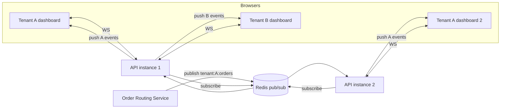
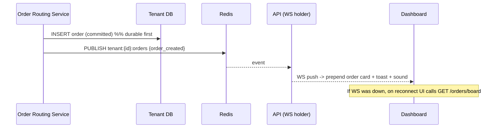
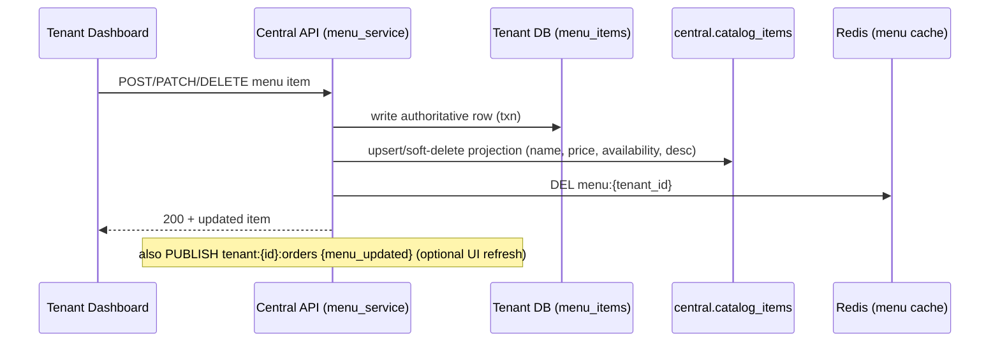

# Phase 05 — Real-time Pipeline & Data Sync

Covers two flows the brief emphasizes:
1. **Real-time orders** appearing/updating on the tenant dashboard.
2. **Menu sync** so a tenant's menu edits reflect in the central catalog (agent).

## 5.1 Real-time architecture

Use **FastAPI WebSockets** for the browser connection and **Redis pub/sub** for
fan-out so it works across multiple backend instances on Railway.

### WebSocket gateway (`/ws/orders`)
- **Auth on connect:** client sends the access JWT via the `Sec-WebSocket-Protocol`
  subprotocol header or a first-message auth frame — **never** a `?token=` query
  param (which leaks into proxy/access logs; see P12 F5). Server validates and
  extracts `tenant_id`. Reject if invalid/expired.
- **Channel scoping:** the connection is subscribed **only** to `tenant:{tenant_id}:orders`.
  A client can never subscribe to another tenant's channel (server derives channel
  from the token, not from client input). This is a key isolation point.
- **Backpressure & limits:** cap connections per tenant; heartbeat ping/pong; drop
  dead sockets. On reconnect, client does a REST "catch-up" fetch (`GET /orders/board`)
  to fill any events missed while disconnected (WS is best-effort; REST is truth).
- **Event types:** `order_created`, `order_status_changed`, `menu_updated` (optional),
  each a small JSON `{type, order_id, status, placed_at, summary}`.

### Why Redis pub/sub (not just in-process)
With horizontal scaling (multiple API instances on Railway), the order may be
created on instance 1 while the dashboard's WS lives on instance 2. Redis pub/sub
fans the event to all instances; each pushes to its locally-connected, tenant-matched
clients.

> Note: Redis pub/sub is fire-and-forget. The **source of truth is the tenant DB**;
> WS is an accelerator. The reconnect catch-up fetch guarantees correctness even if
> an event is missed. (If we later need guaranteed delivery, upgrade to Redis Streams.)

## 5.2 Order real-time sequence (recap with delivery guarantee)

Latency target: order visible on dashboard **< 1.5s** after creation (usually
sub-second).

## 5.3 Menu sync (tenant → central catalog)

The **tenant DB is the source of truth** for the menu; the **central catalog** is a
projection the agent reads. On every menu write:

### Consistency model
- **Read-your-writes** for the owner: the API updates both stores in the same request
  path; the dashboard immediately shows the new item.
- **Agent freshness:** the agent reads `get_menu` from Redis cache; cache is
  invalidated on write, so the next agent read repopulates from the catalog. Target
  visible-to-agent latency **< 10s** (typically immediate).
- **Failure handling:** if the catalog projection write fails after the tenant write
  succeeds, enqueue a **reconciliation** job (outbox pattern) that retries the
  projection. A periodic reconciler also diffs tenant `menu_items` vs central
  `catalog_items` to self-heal drift.

### Outbox pattern (robust sync) — used for BOTH menu and orders
To avoid dual-write inconsistencies, write an outbox row in the **same tenant
transaction** as the change; a background worker reads the outbox and applies the
projection to central, marking it done. Two outboxes:
- `menu_outbox` → projects menu changes to `central.catalog_items`.
- `routing_outbox` → projects order create/status to `central.order_routing_index`
  (status + timestamps only, **no money**; see P12 F3).
A periodic reconciler diffs tenant truth vs central projections to self-heal any
drift. Guarantees projections eventually match the source of truth across crashes.

## 5.4 Caching strategy (Redis)

| Cache | Key | TTL | Invalidation |
|------|-----|-----|--------------|
| Menu for agent | `menu:{tenant_id}` | 5 min | on menu write (DEL) |
| Active tenant list | `tenants:active` | 1 min | on tenant status change |
| Analytics summary | `analytics:{tenant}:{range}` | 60–300 s | on new order / time |
| Rate limiters | `rl:{scope}:{key}` | window | rolling |
| Conversation state | `conv:{phone_hash}` | 6 h idle | on reset/complete |
| Webhook dedupe | `wamid:{message_id}` | 10 min | TTL |

## 5.5 Scaling considerations

- **WS connections** are sticky to an instance but events arrive via Redis, so any
  instance can serve any tenant. Railway can run multiple replicas of the API.
- **Connection pool budget (see P12 F1):** each API instance keeps an LRU of tenant
  engines. Cap concurrent engines (e.g., 50) and pool size per engine small (e.g.,
  2–3) and evict idle tenants. Enforce the budget:
  `replicas × max_engines × pool_size ≤ 80% of Postgres max_connections`. Once tenant
  count exceeds ~10, put **PgBouncer** (transaction pooling) in front of Postgres so
  many logical tenant pools share few physical connections. Promote busy tenants to
  bigger pools/dedicated DB services per the P09 ladder.
- **Background processing:** webhook handling, WhatsApp send retries, menu outbox,
  and notifications run as Redis-backed tasks/workers (not in-request), so they
  survive restarts and scale independently.

## 5.6 Frontend real-time UX

- New order → card animates in at top of the board, plays a short sound, increments
  an "active" badge, and shows a toast. (P06 details.)
- Status change from another staff member → card moves columns live (kanban).
- Connection status indicator (green = live, amber = reconnecting) so staff trust the
  board. On reconnect, a silent catch-up fetch reconciles state.

Proceed to [Phase 06 — Frontend Design](./06-frontend-design.md).
