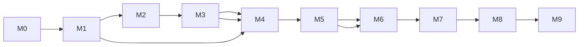

# Phase 11 — Roadmap & Milestones

Sequenced build order. Each milestone is shippable/testable and builds on the prior.
Estimates assume one focused developer; adjust for team size.

## M0 — Foundations (from current code) — ~3–4 days
- Extend `settings.py` for Postgres/Redis/JWT/Fernet/WhatsApp app secret.
- Add SQLAlchemy async + Alembic (central + tenant trees).
- Stand up central DB schema (P02 §2.1) + migrations.
- Add Redis. Move conversation sessions from in-memory → Redis (P04 §4.3).
- **Add webhook HMAC signature verification** (P08 §8.4) + message dedupe.
- **Exit:** existing bot runs on Postgres/Redis with secure webhook; central DB live.

## M1 — Tenancy core & provisioning — ~4–5 days
- Tenant registry + connection routing (LRU engine cache, Fernet creds) (P01 §1.5).
- Provisioning service: create DB/role/migrations/registry (P02 §2.3).
- Order Routing Service skeleton (create/read in tenant DB) (P03 §3.2).
- Isolation tests (P10 §10.2) wired into CI.
- **Exit:** can provision a tenant; routing writes to the right DB; isolation tests green.

## M2 — Auth & RBAC — ~3 days
- Login/refresh/logout, argon2id, JWT + refresh rotation + reuse detection (P03 §3.3).
- RBAC dependencies; tenant-context dependency with subdomain check.
- **Exit:** secure multi-role login; deny-by-default enforced + tested.

## M3 — Menu + central catalog + sync — ~3–4 days
- Tenant menu CRUD (P03) + publish projection to central catalog + outbox (P05 §5.3).
- Redis menu cache + invalidation.
- Migrate agent to read live menu from catalog (replace `data/restaurants.py`).
- **Exit:** owner edits menu → agent quotes new prices within seconds.

## M4 — Agent tool-calling + order placement — ~4–5 days
- Convert agent to Gemini function-calling tools (P04 §4.2); server-side pricing.
- `create_order` → routing service → tenant DB + routing index (no money) (P01 §1.6).
- Idempotency + durability + fallbacks.
- **Exit:** WhatsApp order persists to tenant DB; central routing index updated.

## M5 — Real-time + tenant dashboard (orders) — ~5–6 days
- WebSocket gateway + Redis pub/sub (P05 §5.1).
- React app scaffold + design system (P06); login; live order kanban + order detail;
  status updates → customer notifications (P03 §3.5).
- **Exit:** new orders appear live; staff advance status; customer gets WhatsApp updates.

## M6 — Analytics — ~4–5 days
- Tenant analytics endpoints + rollup table (P07); Recharts dashboards with filters.
- Central admin operational analytics (money-free).
- **Exit:** filtered/unfiltered charts on both dashboards.

## M7 — Central Admin dashboard — ~3–4 days
- Tenants list + provision UI, agent monitor, WhatsApp number mapping, audit log (P06 §6.4).
- **Exit:** admin can onboard + monitor tenants end-to-end.

## M8 — Hardening, deploy, observability — ~3–4 days
- Rate limiting, CSP/CORS, secret scanning, dependency audit (P08).
- Railway services (web/worker/frontend/PG/Redis), CI/CD, backups, health, alerts (P09).
- Load + chaos tests (P10 §10.6).
- **Exit:** passes Phase 08 security checklist; deployed on Railway with monitoring.

## M9 — UAT & launch — ~2–3 days
- Full UAT scripts (P10 §10.8), docs, runbooks. Pilot with 1–2 real restaurants.

---

## Sequencing diagram (dependencies)

## Risk register

| Risk | Likelihood | Impact | Mitigation |
|------|:--:|:--:|------------|
| Cross-tenant leak | Low | Catastrophic | DB-per-tenant + roles + isolation tests gate (P08/P10) |
| Connection-pool blowup (many tenants) | Med | High | LRU engine cap + small pools + PgBouncer (P05/P09) |
| Railway cost of per-tenant DBs | Med | Med | Cost ladder: shared cluster → dedicated later (P09 §9.3) |
| LLM cost/abuse | Med | Med | Per-phone rate limits, budgets, tool confinement (P04/P08) |
| Dual-write menu drift | Med | Med | Outbox + reconciler (P05 §5.3) |
| Lost orders on failure | Low | High | Durable-before-confirm + idempotency (P03/P04) |
| Migration drift across tenants | Med | Med | Migrate-all job + drift health check (P02/P09) |
| WhatsApp 24h window / templates | Med | Med | Use approved templates for out-of-window notifications (P04) |

## Definition of done (v1)
Meets all Phase 00 §0.6 success metrics, passes Phase 08 checklist and Phase 10
isolation suite, and is deployed on Railway with backups + monitoring.

Proceed to [Phase 12 — Review, Criticism & Improvements](./12-review-criticism-improvements.md).
